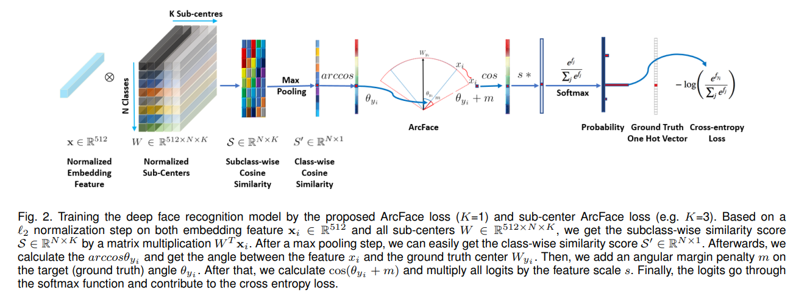

# Facial-Recognition --- Research-Project
The aim of the project is to propose an ML model and a DL model capable of filling in the attendance sheet after taking a photo of the classroom.
## Installation
To run this project, please make sure you have the following libraries installed:
### Requirements
- torch
- torchvision
- numpy
- pandas
- mathplotlib
- cv2
- ultralytics
- scikit-learn
- xgboost
- face_alignment

You can install these libraries using pip:
```bash
pip install torch torchvision numpy pandas matplotlib opencv-python ultralytics scikit-learn xgboost face-alignment
```
## Features

### Face Detection:
Employed the pretrain model `YOLOv8` to focus solely on face detection rather than identifying entire objects. Since we need to detect multiple faces in a single image, `YOLOv8` is well-suited for this task. If you don't have the model weights, you can download them from this [link](https://github.com/derronqi/yolov8-face).
### Face Recognition:
We explored two different approaches for face recognition: traditional Machine Learning (ML) and Deep Learning (DL).
In particular:
#### 1. ML approach: 
- Extracted facial landmarks using `face_alignment` library, then classified the faces using `SVM` and `XGBoost`. Follow this [link](https://github.com/1adrianb/face-alignment) for more details about the library.
<div align='center'>

<br>
Source: https://github.com/1adrianb/face-alignment
</div>

#### 2. DL approach:
- Employed `Additive Angular Margin Loss` with `ResNet34` as backbone to enhance intra-class compactness and inter-class separability. The idea is to project the features onto a hypersphere and then add an angular margin penalty to the target logit, which encourages the model to learn more discriminative features for face recognition. For more details, refer to this [paper](https://arxiv.org/abs/1801.07698).
<div align='center'>

<br>
Source: ArcFace: Additive Angular Margin Loss for Deep Face Recognition (https://arxiv.org/abs/1801.07698).
</div>

## Scientific Article

Here is the link of Scientific Article: https://drive.google.com/file/d/1HQyNPI_mggBHq7PiXhqvFCPBhPnEa908/view?usp=sharing